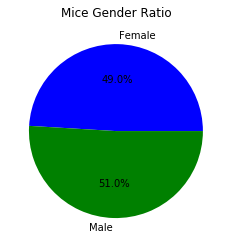
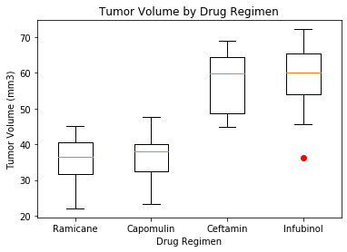

# PowerPlots-challenge

Data for a drug study in mice was analyzed for information collected over the course of 45 days.  Tumor volume statistics were used to compare the success of each drug regimen.  Sample population was also examined for size distribution and gender.  Data was charted and anlayzed for results comparing the treatments.  

## Observations and Insights 

* For this dataset, the number of mice tested was greatest for Capomulin and Ramicane and was least for Propriva.  The division between male and female mice was split relatively evenly.

* The data for Capomulin and Ramicane showed the least variability with the lowest standard deviation and standard error of the mean.  In addition, these drugs show the smallest final tumor volume indicating effectiveness in treatment.

* For Capomulin, there is a strong correlation between the tumor volume and mouse weight with a correlation coefficient of 0.84 and an r-squared value of 0.71.  

* Capomulin and Ramicane are the most promising drug regimens in this study given the large sample size, low variability, and greatest tumor volume reduction.